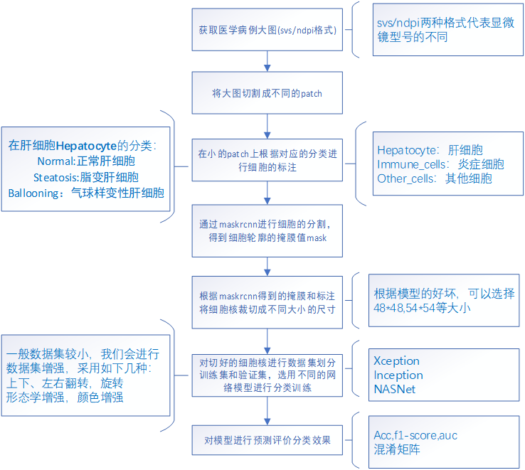

# 项目背景介绍
## 1.项目研究意义
   肝脏是动物最大、功能最广泛的器官之一。它将食物中的糖、蛋白和脂肪转化为对身体有用的物质，并将它们释放到细胞中。肝脏除了在新陈代谢中发挥作用外，还是一种免疫器官，对血液的排毒是必不可少的。肝脏对健康具有极大的重要性，所以对于肝脏细胞病变的预防以及研究具有很大的意义。基于相应的基础研究，人们对于病毒性肝炎及病毒如何入侵并危害肝脏已经有了相对成熟、系统的认知和应对策略。然而，人们往往会视外侵者为“眼中钉”，反而对过量脂质等潜入者的危害视而不见，对非酒精性脂肪肝炎的新近病理生理研究显示，有“潜入者”的肝脏细胞，也能启动免疫体系，如果程度严重甚至启动“毁灭”程序。
当非酒精性脂肪肝病发展到严重的炎症阶段，肝脏内巨噬细胞就会异常活跃起来，它们会从血液中募集更多兄弟炎症细胞，例如白细胞就会进到肝脏里面，出现炎症细胞浸润。“这个时候如果做病理分析，就会看到肝脏里面有很多炎症细胞，围着变大的肝脏细胞。”姬燕晓说，这就说明肝脏细胞里边“出事儿”了，不要以为炎症细胞是去解救肝脏细胞的，很可能炎症细胞已经认为它是不正常细胞，想把它干掉。而这个机制与肝炎病毒入侵后，免疫系统对带毒肝脏细胞的“绞杀”很相似。


## 2.项目具体流程

# 运行环境要求
```python
pip install keras==2.2.0
pip install tensorflow-gpu==1.7.0
pip install numpy==1.14.5
pip install opencv-python==3.4.4.19
# 代码需要spams库的支持，126已安装
# 若提示缺少spams，请按照以下步骤安装
#具体步骤：
#1.现在用户主目录下创建src目录，然后切换到src目录下操作
mkdir ~/src
cd ~/src

#2.安装blas
wget http://www.netlib.org/blas/blas.tgz
tar zxf blas.tgz
cd BLAS-3.5.0/

#3、编译
#如果是32位系统，使用GNU的g77或gfortran编译器来编译：
g77 -O2 -fno-second-underscore -c *.f
gfortran -O2 -std=legacy -fno-second-underscore -c *.f

#如果是64位系统，使用GNU的g77或gfortran编译器来编译：
g77 -O3 -m64 -fno-second-underscore -fPIC -c *.f
gfortran -O3 -std=legacy -m64 -fno-second-underscore -fPIC -c *.f

#如果使用的是Intel的Fortran编译器，则：
ifort -FI -w90 -w95 -cm -O3 -unroll -c *.f

#注意：
#请根据情况选择上述5个命令中的一个执行
#在编译BLAS、LAPACK、NumPy和SciPy的时候，所选择的Fortran编译器必须要保持一致
#在下述LAPACK的编译安装中，需要使用Fortran 90编译器，因此不应该使用g77来编译BLAS
4.安装LAPACK
wget http://www.netlib.org/lapack/lapack.tgz
tar zxf lapack.tgz
cd lapack-3.6.0/
#5.注意：在执行make lapacklib之前，编辑make.inc文件，给OPTS和NOOPT这两个设置都加上-fPIC选项。如果是64位系统，还需要加上-m64选项。修改后
FORTRAN  = gfortran 
OPTS     = -O2 -frecursive -fPIC -m64
DRVOPTS  = $(OPTS)
NOOPT    = -O0 -frecursive -fPIC -m64
LOADER   = gfortran
#6.编译
cp INSTALL/make.inc.gfortran make.inc   # On Linux with lapack-3.2.1 or newer
make lapacklib
#7.后续工作
make clean      # 清理文件
export LAPACK=~/src/lapack-3.6.0/   # 导出LAPACK环境变量
```
# 代码整理封装
maskrcnn文件夹里面保存的是用于进行细胞核分割的代码

# 使用范例说明
# 使用数据清单
# 历史训练结果
